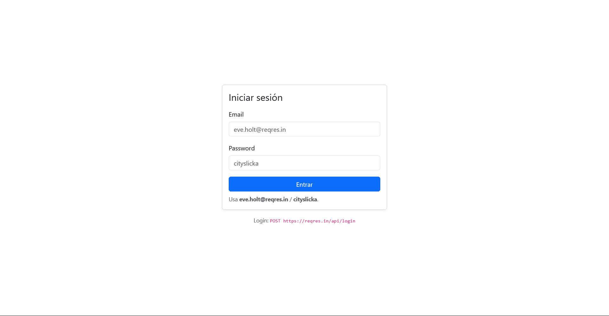
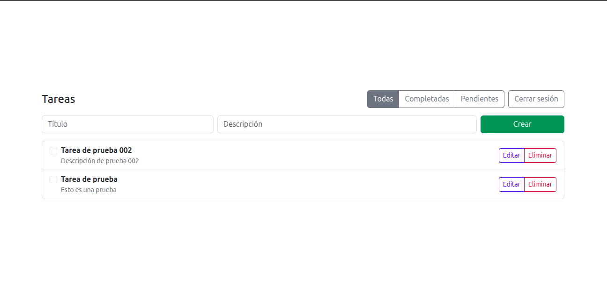
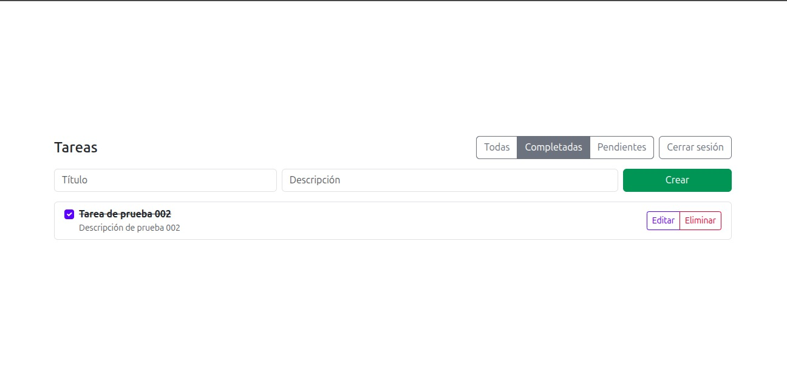
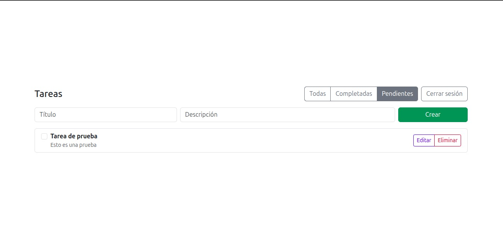
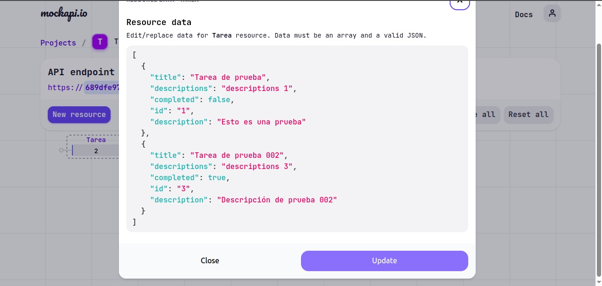

# Prueba Técnica Tecnoglass – React SPA (ReqRes + MockAPI)

Aplicación SPA en _React_ que cumple los requisitos de la prueba:

- _Login_ con POST https://reqres.in/api/login (guarda token en localStorage)
- _CRUD de tareas_ contra _MockAPI_ (lista, crear, editar, eliminar, toggle completed, filtros)
- _Tecnologías: React (Hooks), \*\*Bootstrap_, react-router-dom, \*\*axios`
- _Sin Redux_ ni frameworks UI adicionales

---

## 🚀 Cómo ejecutar

> Requisitos: Node 18+ (recomendado Node 20) y npm.

```bash
# 1) Instalar dependencias
npm install

# 2) Crear archivo .env (ver sección Variables de Entorno)
#    y pegar ahí tu URL de MockAPI.

# 3) Ejecutar en desarrollo
npm run dev
```

## 🌐 Api MockApi
https://689dfe97ce755fe6978ab9d9.mockapi.io/tarea/v1

## 🖼️ Capturas

<p align="center">
  
  <br/>
  <sub><b>Login</b></sub>
</p>

<p align="center">
  <span style="display:inline-block; text-align:center;">
    
    <br/>
    <sub><b>Listado de tareas</b></sub>
  </span>
  &nbsp;&nbsp;&nbsp;
  <span style="display:inline-block; text-align:center;">
    
    <br/>
    <sub><b>Listado de tareas completadas</b></sub>
  </span>
  &nbsp;&nbsp;&nbsp;
  <span style="display:inline-block; text-align:center;">
    
    <br/>
    <sub><b>Listado de tareas pendientes</b></sub>
  </span>
  &nbsp;&nbsp;&nbsp;
  <span style="display:inline-block; text-align:center;">
    
    <br/>
    <sub><b>Interfaz admin de mockapi.io</b></sub>
  </span>
</p>
